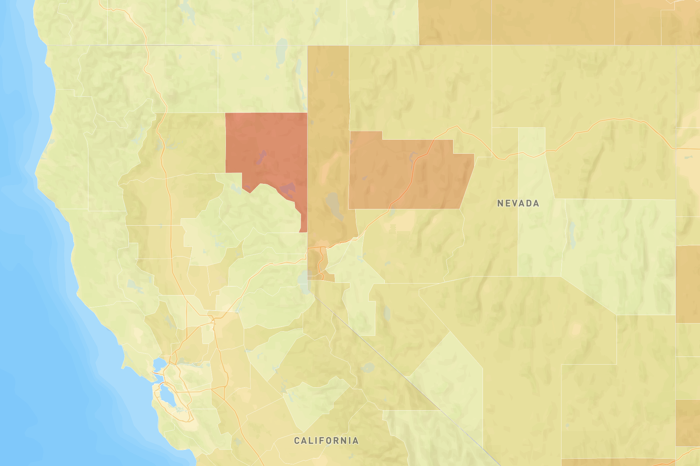

# Covid Rates and Counts in the United States
## Ryan Fournier
## Geog 458
## Lab 3
### Project Name: CovidRatesL3

#### Introduction
In this project, I created two webmaps that displayed data from the New York Times to create a choropleth map and a proportional symbol map using MapBox.

#### Map 1 (Choropleth)

The choropleth map showed Covid rates by Census tract. Rates are defined by the total number of cases divided by 1000 residents. The higher the rate of Covid cases, the darker the color of the Census Tract. The map was created using Mapbox Studio and was further developed using Mapbox JS and html. Census tract shapes were provided from the United States Census Bureau. 

[Map 1 Link](https://4nierr.github.io/map1.html)

#### Map 2 (Proportional Symbol)

The second map is a proportional symbol map that shows total cases per county in the United States. The more cases, the bigger the symbol and the darker the color is that represents it. Clicking on the symbol will bring up a popup box that shows the county name as well as the state and the total number of cases for that area. The basemap was provided by Mapbox, the data was layered on top through a geoJSON file using Mapbox JS. 

[Map 2 Link](https://4nierr.github.io/map2.html)

#### Sources

[The New York Times](https://github.com/nytimes/covid-19-data/blob/43d32dde2f87bd4dafbb7d23f5d9e878124018b8/live/us-counties.csv)
[2018 ACS 5 year estimates](https://data.census.gov/cedsci/table?g=0100000US.050000&d=ACS%205-Year%20Estimates%20Data%20Profiles&tid=ACSDP5Y2018.DP05&hidePreview=true)
[The U.S. Census Bureau](https://www.census.gov/geographies/mapping-files/time-series/geo/carto-boundary-file.html)

#### Credit

Choropleth map created with tutorial from Mapbox, tutorial [here](https://docs.mapbox.com/help/tutorials/choropleth-studio-gl-pt-1/).

#### Libraries

* Mapbox Studio
* Mapbox GL JS
* Github Pages
